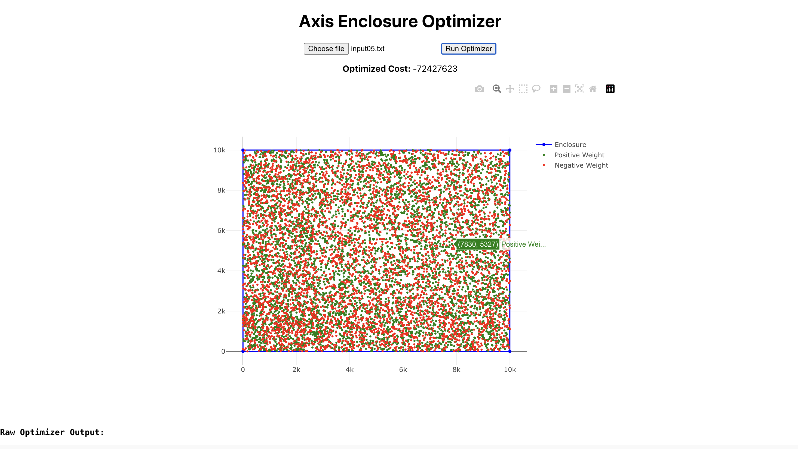

# 🧿 Axis Enclosure Optimizer – Full-Stack Web App

This is the full-stack deployment of the **Axis-Aligned Enclosure Optimization** problem originally solved using C++.

It wraps the C++ optimizer in a **Flask API**, exposes it via a **React frontend**, and is hosted entirely in the cloud.

---

## 🚀 Live Demo

👉 Frontend (React): [https://axis-opti-visual.vercel.app](https://axis-opti-visual.vercel.app)  
👉 Backend (Flask + C++): [https://axis-backend-c9m2.onrender.com](https://axis-backend-c9m2.onrender.com)

---

## 🧠 Core Problem

Given `N` buildings on a 2D grid (each with a penalty), select a **simple, axis-aligned rectangle** that encloses at least `K` buildings with:

```
Total Cost = Perimeter of Rectangle + Sum of Penalties of Enclosed Buildings
```

This problem is NP-Hard. We implemented an approximation using:
- Greedy selection based on penalties
- Negative weight prioritization
- Heuristic bounding rectangle evaluation

---

## 🖥️ Tech Stack

### 🟢 Frontend
- React + Axios + Plotly.js
- File upload & data visualization

### 🟡 Backend
- Flask (Python)
- C++ binary compiled at runtime
- Secure file handling + subprocess call

### ☁️ Hosting
- Frontend on **Vercel**
- Backend on **Render**

---

## 📸 Screenshot

Here’s the app in action:




---

## 📁 Project Structure

```
axis-opti-visual/
├── client/         # React frontend
├── server/         # Flask backend
│   ├── code.cpp    # C++ source code
│   ├── axis_optimizer.bin  # compiled binary (in production)
│   ├── start.sh     # Flask + binary start script
├── inputXX.txt     # Sample input files
```

---

## 🔗 Related

- Original C++-only version: [axis-opti-1274](https://github.com/adyasa2004/axis-opti-1274)

---

## 🧾 License

Released under the **MIT License**. Free for personal, academic, and commercial use.

_Last updated: June 24, 2025_
